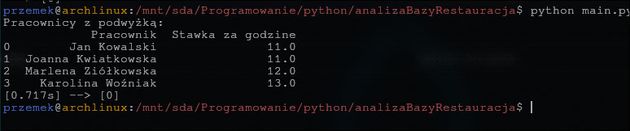

# Analiza Bazy Restauracji

Projekt służy do analizy przykładowej bazy danych restauracji zapisanej w SQLite na podstawie pliku SQL.
Program wyświetla tabele z pracownikami, tylko co dostaną podwyżkę

## Struktura projektu

- `main.py` – główny plik uruchamiający analizę bazy danych.
- `config.py` – konfiguracja projektu oraz funkcje pomocnicze do obsługi bazy.
- `databases/restauracja.sql` – definicja i przykładowe dane bazy restauracji.
- `restauracja.db` – plik bazy danych SQLite (generowany).
- `__pycache__/` – pliki cache Pythona.

## Wymagania

- Python 3.11+
- Pakiety: `pandas`, `sqlite3`

## Uruchomienie

1. Zainstaluj wymagane pakiety:
    ```bash
    pip install pandas
    ```
2. Uruchom analizę:
    ```bash
    python main.py
    ```

## Funkcjonalności

- Wczytywanie struktury i danych bazy z pliku SQL.
- Analiza pracowników, którzy otrzymają podwyżkę (stawka > 10.00).

## Autor

Projekt edukacyjny – fikcyjna baza danych restauracji.

## Zrzut ekranu projektu




